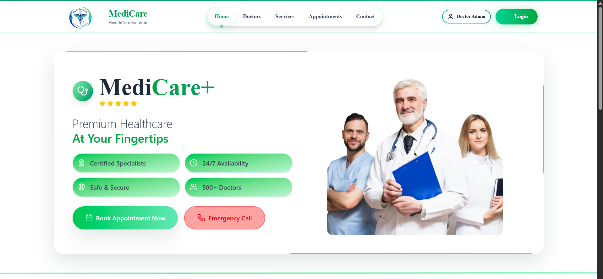
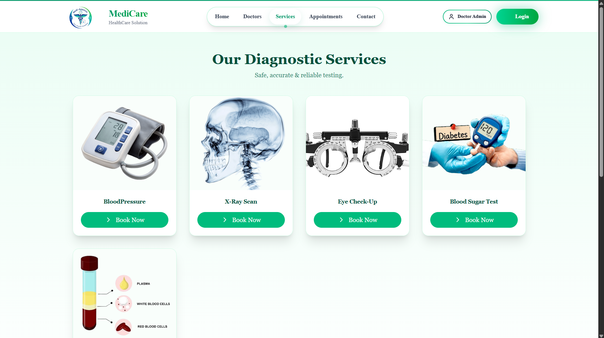
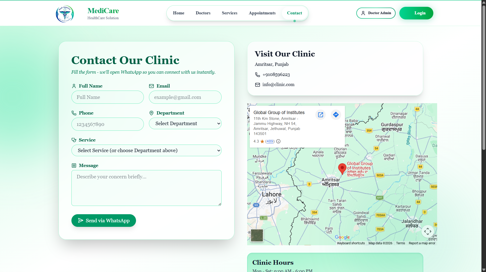
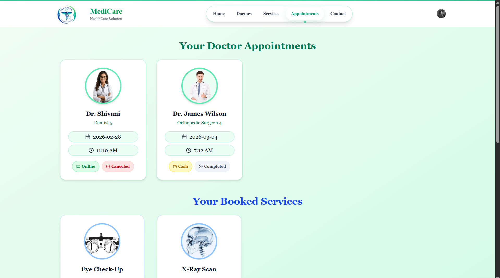
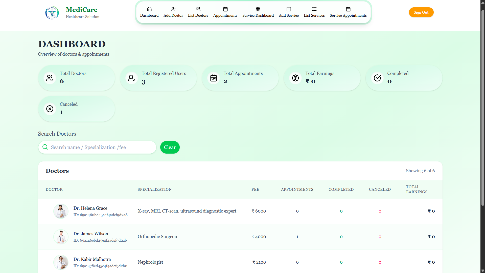

# 🏥 Medicare - Doctor Appointment Booking System

<p align="center">
  
</p>
Medicare is a full-stack healthcare web application that allows patients to search doctors, book appointments, and manage bookings online. The platform also provides an admin dashboard to manage doctors and appointments efficiently. It is built using the MERN Stack (MongoDB, Express.js, React.js, Node.js).

<hr/>

🌐 **Live Website:** https://car-rental-gamma-lime.vercel.app/

📦 **Repository:** https://github.com/ujjawalsingh30/CarRental

---

## ✨ Features

### 👨‍⚕️ Patient Features
* Register and login securely
* Browse available doctors
* Search doctors by specialization
* Book doctor appointments
* View and manage appointment history
* Responsive and user-friendly UI
  
### 🧑‍💼 Admin Features
* Admin dashboard
* Add / remove doctors
* Manage appointments
* View patient bookings
* Monitor platform activity

### 💻 System Features
* Secure authentication
* RESTful API architecture
* Responsive design
* Image upload support
* Real-time appointment management

---

## 🛠 Tech Stack

### 🌐 Frontend


---

### 🖥 Backend


---

### 🔌 Utilities & Services


---

## 📁 Project Structure

```

MEDICARE
│
├── admin                # Admin Panel (React + Vite)
│   ├── node_modules
│   ├── public
│   ├── src
│   │   ├── assets       # Images, icons, static files
│   │   ├── components   # Reusable UI components
│   │   ├── pages        # Admin pages (Dashboard, Doctors, Appointments)
│   │   ├── App.jsx
│   │   ├── index.css
│   │   └── main.jsx
│   │
│   ├── .env
│   ├── .gitignore
│   ├── eslint.config.js
│   ├── index.html
│   ├── package.json
│   ├── package-lock.json
│   ├── README.md
│   ├── vercel.json
│   └── vite.config.js
│
├── backend              # Node.js + Express Backend
│   ├── config           # Database and cloud configuration
│   ├── controllers      # Business logic
│   ├── middlewares      # Authentication middleware
│   ├── models           # MongoDB models
│   ├── routes           # API routes
│   ├── upload           # Uploaded images/files
│   ├── utils            # Helper functions
│   │
│   ├── node_modules
│   ├── .env
│   ├── package.json
│   ├── package-lock.json
│   └── server.js
│
├── frontend             # User Panel (React + Vite)
│   ├── node_modules
│   ├── public
│   ├── src
│   │   ├── assets       # Images and icons
│   │   ├── components   # Reusable components
│   │   ├── doctor       # Doctor related UI
│   │   ├── pages        # User pages
│   │   ├── App.jsx
│   │   ├── index.css
│   │   └── main.jsx
│   │
│   ├── VerifyPaymentPage.jsx
│   ├── VerifyServicePaymentPage.jsx
│   ├── .env
│   ├── .gitignore
│   ├── eslint.config.js
│   ├── index.html
│   ├── package.json
│   ├── package-lock.json
│   ├── README.md
│   ├── vercel.json
│   └── vite.config.js
│
└── README.md
```

---

## 🧠 How Car Rantel Works

### 🔐 Authentication
- Passwords hashed using **bcrypt**
- JWT tokens stored in **HTTP-only cookies**
- Protected routes using middleware

### Doctors Data
- Product data stored in MongoDB
- Images uploaded using **Multer**
- Media hosted on **Cloudinary**

---

## ⚙️ Environment Variables

Create a `.env` file inside **server/**:

```

##################################
# Database
##################################
MONGO_URI=your_mongodb_connection_string

##################################
# Authentication
##################################
JWT_SECRET=your_jwt_secret

##################################
# Cloudinary
##################################
CLOUDINARY_NAME=your_cloud_name
CLOUDINARY_API_KEY=your_api_key
CLOUDINARY_SECRET_KEY=your_secret_key
##################################


```

⚠️ Never commit `.env` files to GitHub.

---

## 🚀 Getting Started

### Admin

```
cd Admin
npm install
npm run dev
```


### Backend
```
cd server
npm install
npm run server 
```

### Frontend
```
cd client
npm install
npm run dev
```

## 📈 Future Improvements

* Online payment integration
* Doctor availability scheduling
* Email appointment notifications
* Mobile application support

---

## Project Screenshots

🗂 👨‍⚕️ Doctors Page

The Doctors page lists all available medical specialists with their profile, specialization, and experience. Users can search doctors and easily book appointments.
<p align="center">
  
</p>


🧪  Services

The Services page displays available diagnostic services such as blood pressure tests, X-ray scans, eye check-ups, and blood sugar tests. Patients can book medical services directly from this page.
<p align="center">
  
</p>

📞 Contact Page

The Contact page allows patients to connect with the clinic by filling out a form. Users can send their queries directly via WhatsApp and also view the clinic location using an integrated Google Map.
<p align="center">
  
</p>


📅 Doctor Appointments

This page allows users to view and manage their booked doctor appointments. It displays appointment details such as doctor name, date, time, payment method, and booking status.
<p align="center">
  
</p>


🧑‍💼 Admin Dashboard

The Admin Dashboard provides an overview of the platform including total doctors, registered users, appointments, earnings, and booking status. Administrators can monitor doctor performance and manage appointments from a centralized interface.
<p align="center">
  
</p>


---
